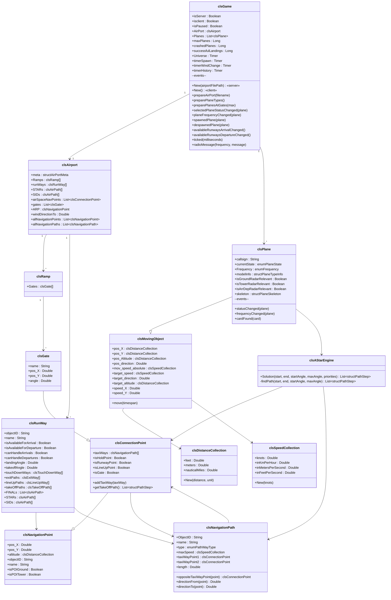

# Architecture

## Technology Stack

| Layer | Technology |
|---|---|
| Language | Visual Basic .NET |
| Framework | .NET Framework 4.7.2 |
| UI | Windows Forms + GDI+ |
| Serialization | `BinaryFormatter` (binary wire protocol) |
| Pathfinding | Custom A* (`clsAStarEngine`) |
| Networking | Raw TCP (`TcpListener` / `TcpClient`) |

---

## Class Diagram



---

## Layer Overview

```
┌─────────────────────────────────────────────────────────┐
│                        Forms (UI)                       │
│  frmMainMenu  frmMenu  frmGroundRadar  frmTowerRadar    │
│  frmAppDepRadar  frmAllControl                          │
├─────────────────────────────────────────────────────────┤
│                    Game Engine                          │
│  clsGame  (timer loop, events, spawn, networking)       │
├──────────────────────┬──────────────────────────────────┤
│   Aircraft           │   Airport Model                  │
│   clsPlane           │   clsAirport                     │
│   clsMovingObject    │   clsRunWay, clsRamp, clsGate    │
│                      │   clsNavigationPoint/Path        │
├──────────────────────┴──────────────────────────────────┤
│               Pathfinding / Coordinates                 │
│   clsAStarEngine       clsEarth                         │
├─────────────────────────────────────────────────────────┤
│                  Shared Utilities                       │
│   clsDistanceCollection   clsSpeedCollection            │
│   mdlHelpers              mdlNetworkhandling            │
└─────────────────────────────────────────────────────────┘
```

---

## Directory Map

```
ATC/
├── Forms/              UI — Windows Forms + custom controls
├── game/               clsGame — core engine
├── moving_objects/     clsPlane, clsMovingObject, unit collections
├── airportclasses/     clsAirport + runway/ramp/gate/path hierarchy
│   ├── ramp/           clsRamp, clsGate, clsConnectionPoint
│   └── runway/
│       ├── arrival/    clsTouchDownWay, clsExitWay, clsAirPath
│       └── departure/  clsTakeOffPath, clsLineUpWay
├── pathfinder/         clsAStarEngine + support types
├── coordinates/        clsEarth (geo → meters)
├── modules/            mdlHelpers, mdlNetworkhandling
└── data/               Airport XML files (.atc)
```
