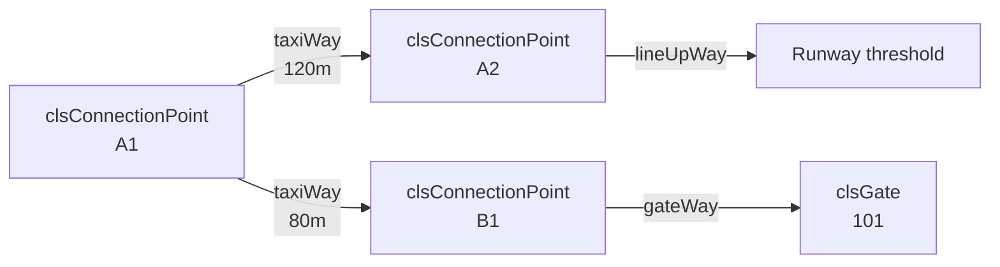
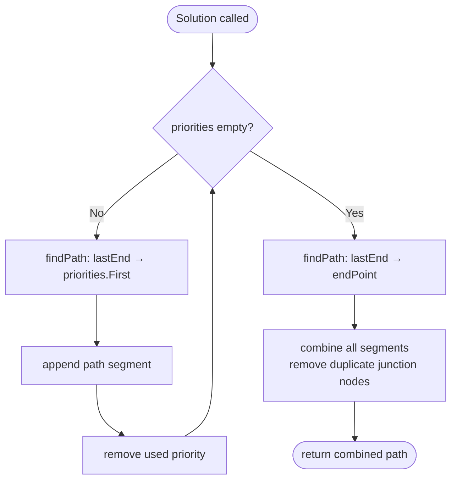

# clsAStarEngine

**File**: `ATC/pathfinder/clsAStarEngine.vb`  
**Scope**: `Public Class` — `<Serializable>`

`clsAStarEngine` computes taxi routes across the airport's ground navigation graph. Each `clsPlane` holds a `WithEvents` instance and listens for the `cardFound` event during path search.

---

## Graph Model

The ground navigation graph is a set of **undirected edges** (`clsNavigationPath`) connecting **nodes** (`clsConnectionPoint`). Each node knows which edges are attached via its `taxiWays` array. A* treats each edge as bidirectional with cost = physical distance.



---

## Public API

### `Solution`

```vb
Friend Function Solution(
    startPoint  As clsConnectionPoint,
    endPoint    As clsConnectionPoint,
    startAngle  As Double,
    maxAngle    As Double,
    Optional priorities As List(Of clsConnectionPoint) = Nothing
) As List(Of structPathStep)
```

Returns an ordered list of steps from `startPoint` to `endPoint`.

**Parameters**

| Name | Description |
|---|---|
| `startPoint` | Node the aircraft is currently at |
| `endPoint` | Destination node |
| `startAngle` | Current aircraft heading (degrees) — biases first step |
| `maxAngle` | Maximum allowed turn per step (degrees) |
| `priorities` | Intermediate waypoints to pass through in order (e.g. a specific taxiway) |

**Return value** — `List(Of structPathStep)`:

```vb
Public Structure structPathStep
    nextWayPoint                    As clsConnectionPoint
    nextWayPointOverrideHeightInFeet As clsDistanceCollection
    taxiwayToWayPoint               As clsNavigationPath    ' edge leading to nextWayPoint
End Structure
```

The first element's `taxiwayToWayPoint` is `Nothing` (no edge before the start node).

---

## Algorithm



### `findPath` (private)

Implements standard A* with:

- **g-cost**: accumulated path distance in metres
- **h-cost**: Euclidean distance to goal
- **Constraint**: turn from previous edge to next edge must not exceed `maxAngle` — prevents the algorithm from routing a plane through a U-turn

---

## `clsAStarCard`

Internal open/closed-list node:

```vb
Public Structure clsAStarCard
    currentPoint    As clsConnectionPoint
    pathToPoint     As clsNavigationPath
    parentCard      As clsAStarCard
    gCost           As Double   ' distance from start
    hCost           As Double   ' estimated distance to goal
    fCost           As Double   ' g + h
End Structure
```

The `cardFound` event fires each time a card is added to the open list — the plane subscribes and can inspect the search progress.

---

## Usage in `clsPlane`

```vb
' Request a new taxi path
Dim engine As New clsAStarEngine
Dim path As List(Of clsAStarEngine.structPathStep) =
    engine.Solution(currentPoint, gateNode, plane.pos_direction, 90)

' Follow the path
plane.ground_taxiPath = path
plane.ground_nextWayPoint = path(0).nextWayPoint
```

---

## Pathfinding Files

The `pathfinder/` folder contains several older implementations kept for reference:

| File | Status |
|---|---|
| `clsAStarEngine.vb` | **Active** |
| `clsAStarCard.vb` | **Active** (support type) |
| `clsVisitedComboCollection.vb` | **Active** (support type) |
| `clsDijkstra*.vb` | Archived — superseded by A* |
| `clsPathFinder*.vb` | Archived — earlier iterations |
