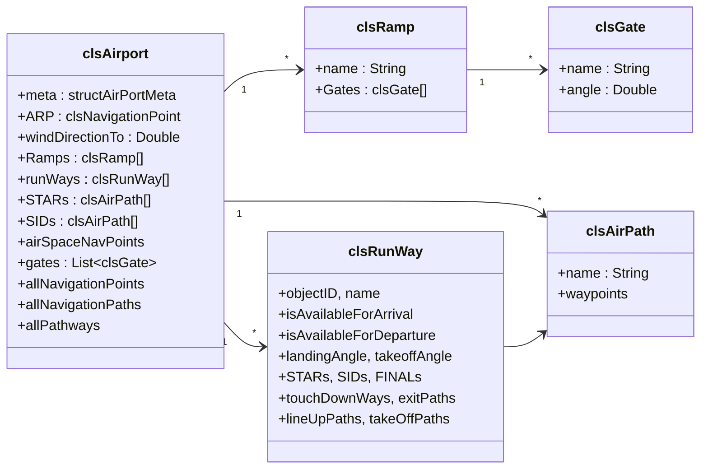

# clsAirport

**File**: `ATC/airportclasses/clsAirport.vb` (26 KB)  
**Scope**: `Public Class` — `<Serializable>`

`clsAirport` is the immutable model of one airport, built by parsing an `.atc` XML file. It is the only object the server sends to clients on connect. Once constructed it is not modified at runtime (except `windDirectionTo` and runway availability flags).

---

## Object Hierarchy



---

## Key Properties

### Meta

| Property | Type | Description |
|---|---|---|
| `meta` | `structAirPortMeta` | Name, IATA, ICAO, date |
| `referenceCoordinate` | `structGeoCoordinate` | ARP geographic position (lat / lng) |
| `ARP` | `clsNavigationPoint` | ARP as a navigation point (origin of coordinate system) |

### Airport Layout

| Property | Type | Description |
|---|---|---|
| `Ramps` | `clsRamp()` | All terminal ramp areas |
| `runWays` | `clsRunWay()` | All runways |
| `gates` | `List(Of clsGate)` | Flat list of all gates (aggregated from Ramps) |
| `landscape` | `clsLandscape` | Boundary polygon for rendering |

### Navigation

| Property | Type | Description |
|---|---|---|
| `allNavigationPoints` | `List(Of clsNavigationPoint)` | All ground-side nav points |
| `allNavigationPaths` | `List(Of clsNavigationPath)` | All taxiway edges |
| `allPathways` | `List(Of clsPathWay)` | Named pathway groups |
| `airSpaceNavPoints` | `List(Of clsConnectionPoint)` | En-route waypoints (air side) |

### Air Routes

| Property | Type | Description |
|---|---|---|
| `STARs` | `clsAirPath()` | Standard Terminal Arrival Routes |
| `SIDs` | `clsAirPath()` | Standard Instrument Departures |
| `POIs` | `Dictionary(Of String, clsNavigationPoint)` | Named points of interest |

### Radar Boundaries

Each of the four radar views (Ground, Tower, AppDep, TRACON) exposes boundary point lists and computed extents:

```vb
groundRadarBoundaryPoints : List(Of clsNavigationPoint)
groundRadarMostTop / MostBottom / MostLeft / MostRight : Double
```

### Runway Availability

`clsRunWay` exposes `isAvailableForArrival` and `isAvailableForDeparture`. `clsAirport` provides convenience helpers:

```vb
openArrivalRunwayIDsAsListOfStrings   ' IDs of open arrival runways
openDepartureRunwayIDsAsListOfStrings ' IDs of open departure runways
usedRunwayIDsAsListOfStrings          ' IDs of currently occupied runways
windDirectionTo : Double              ' current wind direction (degrees)
```

---

## XML Parsing

The constructor accepts an `XElement` (root `<airport>` node). Parsing order:

1. Read meta attributes (`name`, `IATA`, `ICAO`, `date`)
2. Parse `<groundradar>`, `<tower>`, `<appdep>`, `<tracon>` for radar boundaries
3. Parse `<landscape>` polygon
4. Parse `<navpoints>` → build `clsConnectionPoint` objects
5. Parse `<taxiways>` → build `clsNavigationPath` edges (connects points)
6. Parse `<ramp>` / `<gate>` → build `clsRamp` / `clsGate`
7. Parse `<runway>` → build `clsRunWay` with all sub-paths
8. Parse `<airnavpoints>` → en-route waypoints
9. Parse `<stars>` / `<sids>` → `clsAirPath` arrays

---

## `clsRunWay` Subcomponents

```
clsRunWay
├── arrivalPoint : clsTouchDownWayPoint      — IAF / threshold point
├── touchDownWays : clsTouchDownWay[]         — landing roll segments
├── exitPaths : clsExitWay[]                  — high-speed turnoffs
├── FINALs : List(Of clsAirPath)             — ILS / visual final paths
├── STARs : clsAirPath[]                      — approach routing
├── lineUpPaths : clsLineUpWay[]             — runway entry paths
├── takeOffPoints : clsTakeOffPoint[]         — departure hold points
└── takeOffPaths : clsTakeOffPath[]           — takeoff roll segments
```
