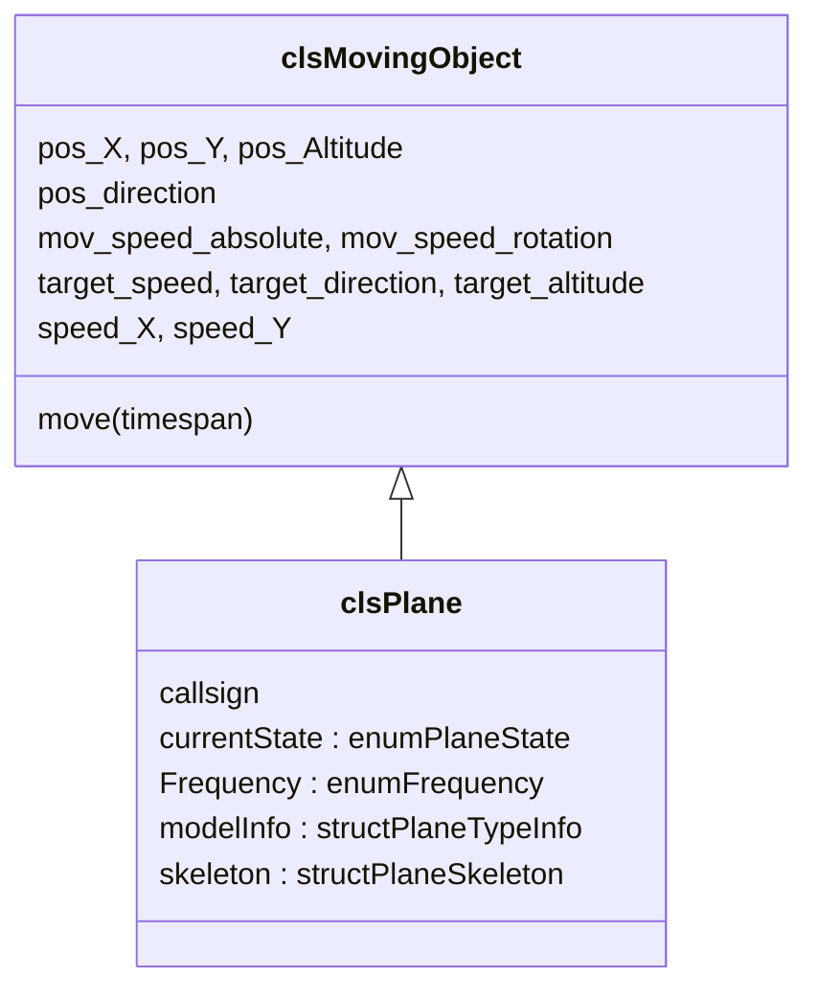

# clsPlane

**File**: `ATC/moving_objects/clsPlane.vb` (~2 255 lines)  
**Inherits**: `clsMovingObject`  
**Scope**: `Public Class` — `<Serializable>`

`clsPlane` models one aircraft in the simulation. It holds the complete state machine, all navigation references (ground path, air path, touchdown / takeoff way), physics properties, and raises events when state or frequency changes.

---

## Inheritance

---

## Key Properties

### Identity

| Property | Type | Description |
|---|---|---|
| `callsign` | `String` | e.g. `"JAL123"` — unique within a game session |
| `modelInfo` | `structPlaneTypeInfo` | Aircraft type data (speeds, dimensions) |

### State

| Property | Type | Description |
|---|---|---|
| `currentState` | `enumPlaneState` | Current state machine state |
| `Frequency` | `enumFrequency` | Current radio frequency |

### Radar visibility

| Property | Returns `True` when |
|---|---|
| `isGroundRadarRelevant` | On the ground or on runway during lineup / touchdown |
| `isTowerRadarRelevant` | In any tower state, or on runway-type taxiway |
| `isArrDepRadarRelevant` | In free flight / final approach, or altitude ≥ 100 ft |

### Navigation (ground)

| Field | Type | Role |
|---|---|---|
| `ground_currentTaxiWay` | `clsNavigationPath` | Currently traversed taxiway segment |
| `ground_goalWayPoint` | `clsConnectionPoint` | Final destination node |
| `ground_nextWayPoint` | `clsConnectionPoint` | Next node on the A* path |
| `ground_taxiPath` | `List(Of structPathStep)` | Remaining A* path steps |

### Navigation (air)

| Field | Type | Role |
|---|---|---|
| `air_currentAirWay` | `clsAirPath` | Active STAR / SID |
| `air_flightPath` | `List(Of structPathStep)` | Remaining waypoints |
| `air_goalWayPoint` | `clsNavigationPoint` | Final airspace waypoint |
| `air_altitudeOverrideByATC` | `Boolean` | ATC has manually set altitude |

---

## Enumerations

### `enumPlaneState`

See [Plane State Machine](../plane-states.md) for the full diagram and transition table.

### `enumFrequency`

| Value | Numeric | Meaning |
|---|---|---|
| `undefined` | 0 | Not set |
| `ground` | 1 | Ground control frequency |
| `tower` | 2 | Tower frequency |
| `departure` | 4 | Departure frequency |
| `arrival` | 8 | Arrival frequency |
| `appdep` | 12 | Combined Approach/Departure |
| `tracon` | 16 | TRACON frequency |
| `radioOff` | 32 | Radio off |

### `enumCommands`

Full list — see [Plane State Machine — ATC Commands](../plane-states.md#atc-commands-reference).

---

## `structPlaneTypeInfo`

Holds all aircraft performance data. Stored in `clsGame.planeTypes`.

| Field | Type | Description |
|---|---|---|
| `maker` | String | Manufacturer name |
| `model` | String | Full model name |
| `modelShort` | String | Short code (e.g. `"B787-8"`) |
| `length` | `clsDistanceCollection` | Fuselage length |
| `wingSpan` | `clsDistanceCollection` | Wingspan |
| `air_Vstall` | `clsSpeedCollection` | Stall speed |
| `air_VRef` | `clsSpeedCollection` | Landing reference speed (Vstall × 1.3) |
| `air_Vcruise` | `clsSpeedCollection` | Cruise speed |
| `air_Vmo` | `clsSpeedCollection` | Maximum operating speed |
| `air_Vfto_V2` | `clsSpeedCollection` | Rotation / initial climb speed |
| `air_ClimbSpeed` | `clsSpeedCollection` | Climb rate |
| `air_DescentSpeed` | `clsSpeedCollection` | Descent rate |
| `air_AltMax` | `clsDistanceCollection` | Service ceiling |
| `air_AltCruise` | `clsDistanceCollection` | Cruise altitude |
| `air_AngleSpeed` | Double | Degrees/tick in the air |
| `ground_AccelerationRate` | `clsSpeedCollection` | Ground acceleration |
| `ground_DescelerationRate` | `clsSpeedCollection` | Ground braking |
| `ground_AngleSpeed` | Double | Degrees/tick on ground |

**Built-in types** (populated in `clsGame.preparePlaneTypes`):

| Short | Full name |
|---|---|
| `B787-8` | Boeing 787-8 Dreamliner |
| `C172R` | Cessna 172R |
| `A380-800` | Airbus A380-800 |

---

## `structPlaneSkeleton`

Lightweight struct transmitted over the wire instead of the full `clsPlane` object. Contains all fields needed for client-side rendering but no behaviour.

---

## Events Raised by `clsPlane`

| Event | When |
|---|---|
| `statusChanged(plane)` | `currentState` changes |
| `frequencyChanged(plane)` | `Frequency` changes |
| `cardFound(card)` | A* engine found a new path card |
