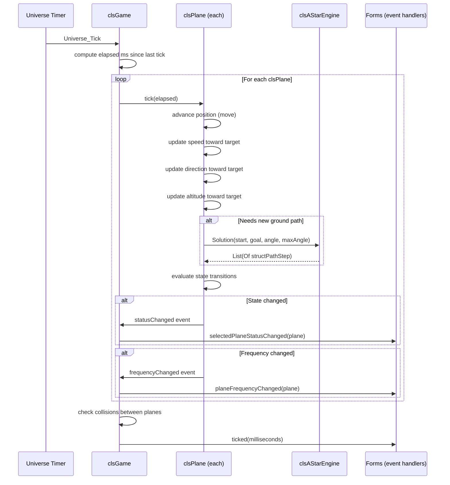
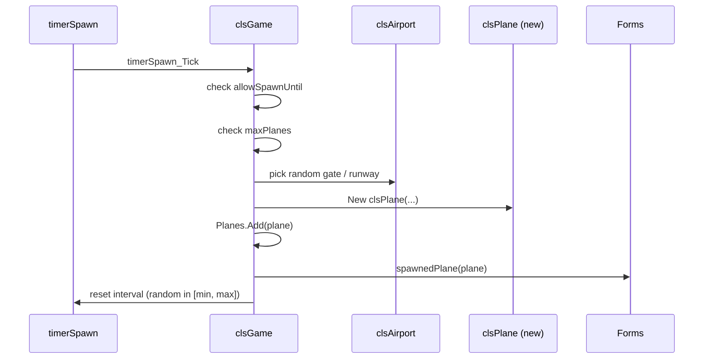
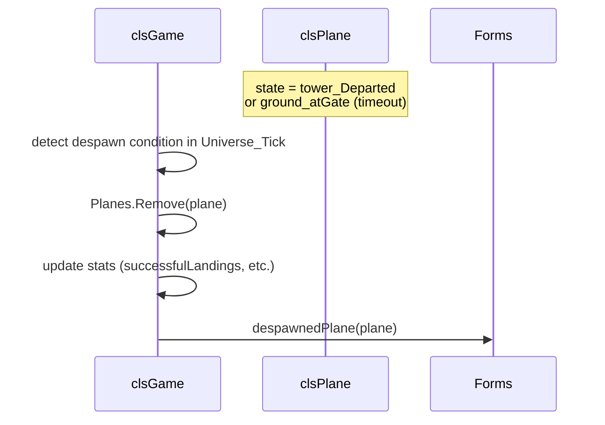
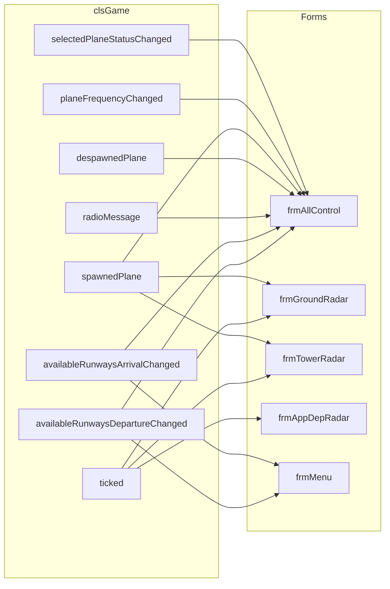

# Game Loop

The simulation runs entirely on `System.Windows.Forms.Timer` instances owned by `clsGame`. There is no background thread; all logic executes on the UI thread.

---

## Timers

| Field | Interval | Role |
|---|---|---|
| `Universe` | 10 ms | Main physics + AI tick |
| `timerSpawn` | configurable | Spawns new aircraft |
| `timerEndGate` | configurable | Removes aircraft that have sat at gate too long |
| `timerWindChange` | configurable | Randomises wind direction/speed |
| `timerHistory` | 1 000 ms | Appends position snapshot to each plane's history |
| `tmrServerSendKeyFrame` | ~100 ms | Server → clients game-state broadcast |
| `tmrServerListen` | 100 ms | Server reads commands from clients |
| `tmrClientListen` | 100 ms | Client reads keyframes from server |

---

## Main Tick Sequence (`Universe`, every 10 ms)

---

## Spawn Cycle

---

## Despawn Cycle

---

## Event Flow (game → UI)

---

## History Recording (`timerHistory`, every 1 s)

Each plane holds a circular buffer of the last `PLANE_HISTORY` (20) position snapshots. `timerHistory_Tick` iterates all planes and appends the current position. Forms use this to draw flight-path trails on radar displays.
