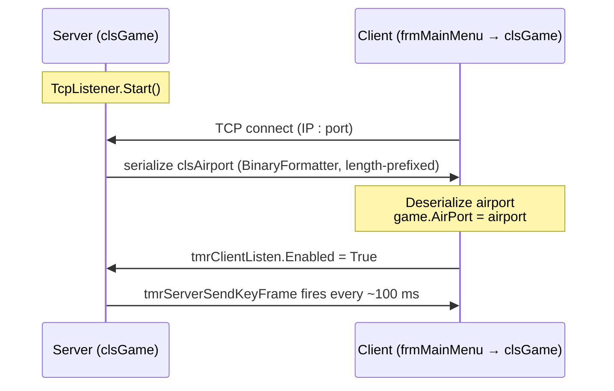
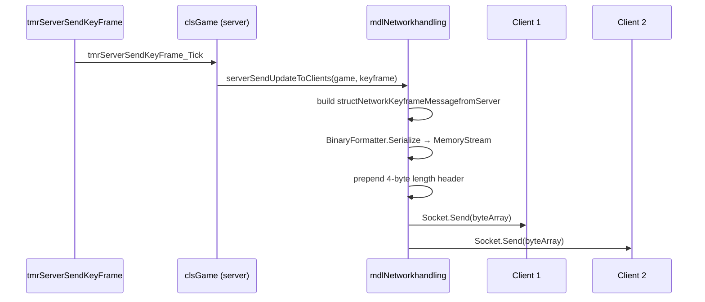
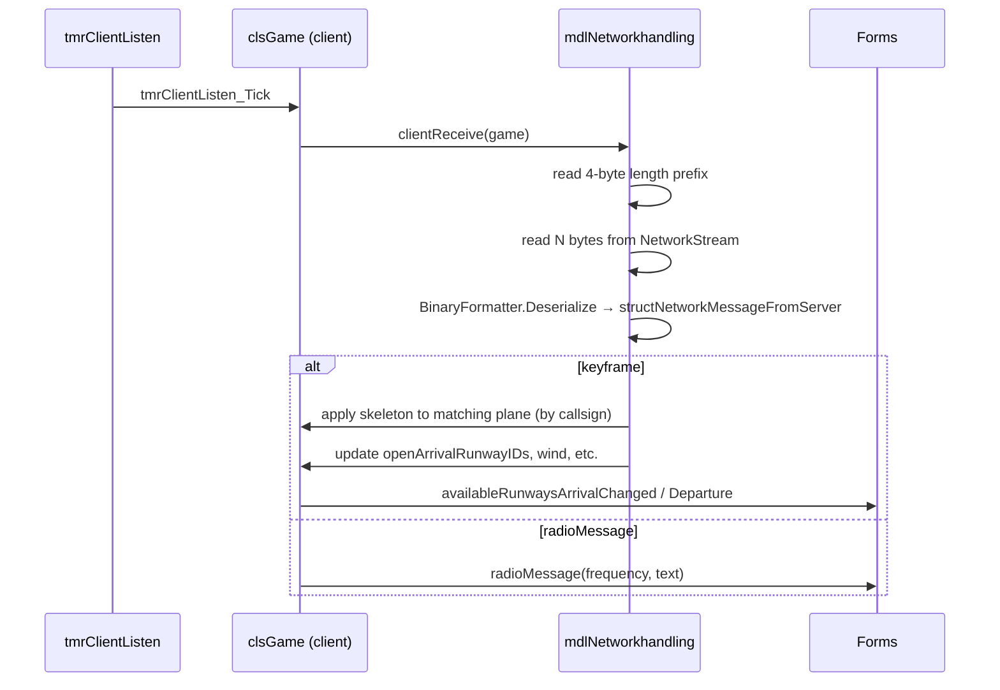

# Multiplayer Networking

The game uses a raw TCP server/client model. One player hosts (server); others join (clients). All game logic runs on the server; clients receive read-only keyframe snapshots and send commands back.

---

## Roles

| Role | `clsGame` constructor | Key flag |
|---|---|---|
| Server | `New clsGame(filePath, ...)` | `isServer = True` |
| Client | `New clsGame()` | `isclient = True` |

---

## Connection Sequence



---

## Wire Protocol

All messages are **length-prefixed binary** frames:

```
┌──────────────────┬────────────────────────────────────┐
│  4 bytes (Int32) │  N bytes (BinaryFormatter payload)  │
│  payload length  │  structNetworkMessageFromServer     │
└──────────────────┴────────────────────────────────────┘
```

### Message types (`enumNetworkMessageType`)

| Value | Direction | Payload type |
|---|---|---|
| `keyframe` | Server → Client | `structNetworkKeyframeMessagefromServer` |
| `radioMessage` | Server → Client | `structRadioMessageNetwork` |
| _(commands)_ | Client → Server | `structCommandInfo` |

### Keyframe payload (`structNetworkKeyframeMessagefromServer`)

```vb
Structure structNetworkKeyframeMessagefromServer
    planeSkeletons         As List(Of clsPlane.structPlaneSkeleton)
    windDirectionTo        As Double
    openArrivalRunwayIDs   As List(Of String)
    openDepartureRunwayIDs As List(Of String)
    usedRunwayIDs          As List(Of String)
    radioMessage           As structRadioMessageNetwork
End Structure
```

### Plane skeleton (`structPlaneSkeleton`)

A lightweight snapshot of one aircraft — replaces the full `clsPlane` object over the wire:

```vb
Structure structPlaneSkeleton
    callsign, currentState, Frequency
    currentSpeedKnots, currentAltitudeFeet, currentDirection
    posXFeet, posYFeet
    targetAltitudeFeet, targetDirection, targetSpeedKnots
    tower_LineUpApproved, tower_clearToLand, tower_takeOffApproved
    air_currentAirPathName, air_flightPathIDs, air_goalWayPointID …
    ground_CurrentTaxiWayID, ground_taxiPathIDs, ground_goalWayPointID …
    modelInfo As structPlaneTypeInfo
End Structure
```

### Command payload (`structCommandInfo`)

```vb
Structure structCommandInfo
    plane                           As String           ' callsign
    command                         As enumCommands
    groundTaxiRunwayCommandParameter As clsRunWay
    groundTaxiGoalPointCommandParameter As clsConnectionPoint
    airDirectionCommandParameter    As Integer
    airNavPointCommandParameter     As clsNavigationPoint
    airAltitudeCommandParameter     As Double
    towerRunwayID                   As String
    ' … additional per-command fields
End Structure
```

---

## Keyframe Broadcast Sequence



---

## Client Receive Sequence



---

## Serialization Note

All types transmitted over TCP carry `<Serializable>` and use `BinaryFormatter`. **Do not replace with JSON or XML serialization** — the binary format is the live wire protocol between running instances.
