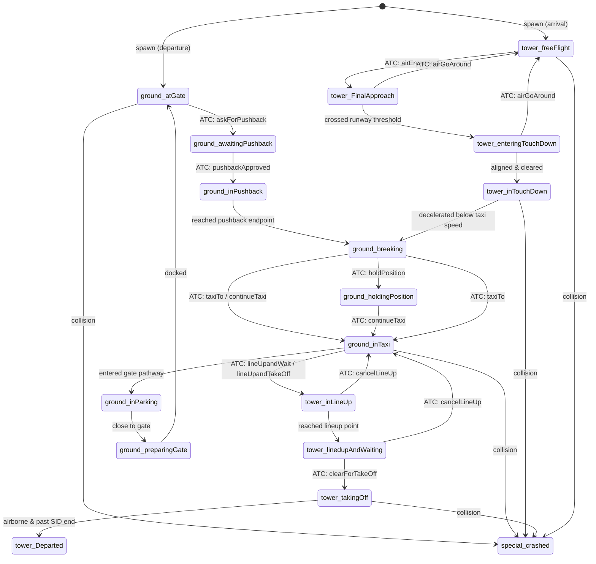
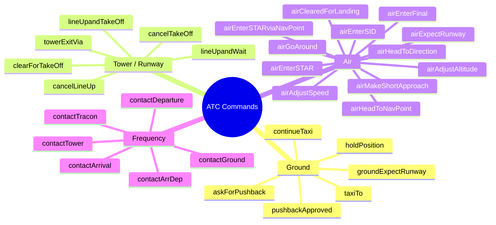

# Plane State Machine

Every `clsPlane` instance always holds exactly one `enumPlaneState` value. The state drives which physics, AI, and radar-visibility rules apply on each game tick.

---

## State Diagram

---

## State Reference

### Ground states

| State | Meaning |
|---|---|
| `ground_atGate` | Parked at gate; engines off |
| `ground_awaitingPushback` | Ready to push back; waiting for ATC approval |
| `ground_inPushback` | Tug reversing aircraft away from gate |
| `ground_breaking` | Decelerating to a stop at a path endpoint or hold position |
| `ground_holdingPosition` | Stopped on taxiway, awaiting further clearance |
| `ground_inTaxi` | Taxiing along the A* ground path |
| `ground_inParking` | Following gate-approach path toward stand |
| `ground_preparingGate` | Final metres — aligning angle, coming to full stop |

### Tower states

| State | Meaning |
|---|---|
| `tower_inLineUp` | Moving onto runway via lineup path |
| `tower_linedupAndWaiting` | Holding on runway threshold, awaiting takeoff clearance |
| `tower_takingOff` | Accelerating along takeoff roll |
| `tower_Departed` | Handed off to departure/en-route; removed from active list |
| `tower_freeFlight` | Inbound, navigating via STARs / waypoints |
| `tower_FinalApproach` | On final, following the FINAL path |
| `tower_enteringTouchDown` | Crossed threshold; selecting touchdown way |
| `tower_inTouchDown` | On runway, decelerating |

### Special state

| State | Meaning |
|---|---|
| `special_crashed` | Terminal — aircraft remains visible on radar |

---

## Radar Visibility Rules

| Radar | Visible states |
|---|---|
| Ground radar | All `ground_*` states, `tower_inLineUp`, `tower_linedupAndWaiting`, `tower_takingOff`, `tower_inTouchDown`, `special_crashed` |
| Tower radar | All `tower_*` states; also ground states while on runway-type paths |
| Approach/Departure | `tower_freeFlight`, `tower_FinalApproach`, or altitude ≥ 100 ft |

---

## ATC Commands Reference

